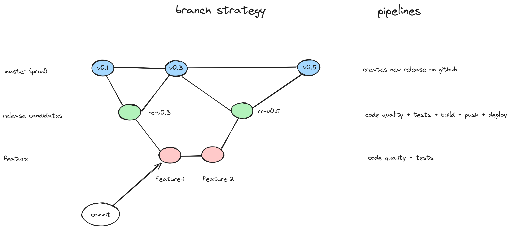
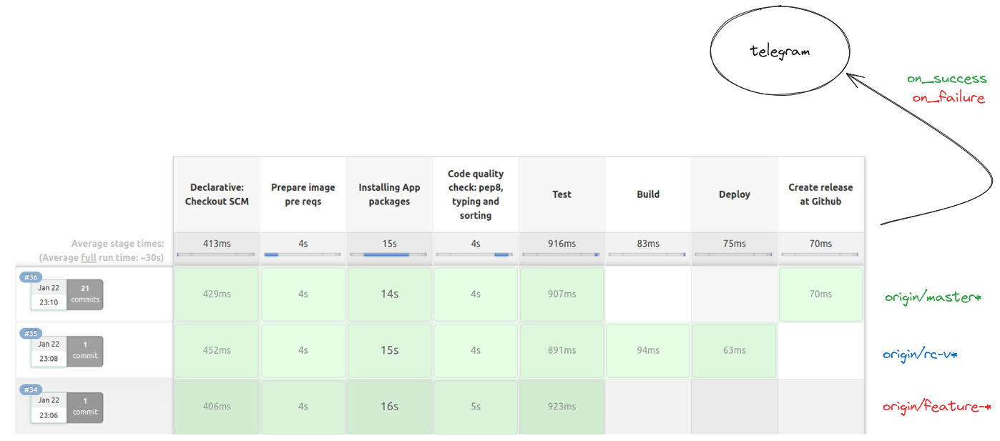

# python-seed-project


[](https://jenkins.qwerty.com.ar/job/python-seed/)
[](https://coveralls.io/github/joagonzalez/python-seed?branch=origin/master)
---
**Content**
- [Getting started](#getting-started)
- [Branch strategy](#branch-strategy)
- [Documentation](#documentation)
- [CICD Pipeline ](#cicd-pipeline)
- [Build](#build)
- [Run](#run)
    - [Local development](#local-development)
    - [Production](#production)
- [References](#references)
---

## Getting started

This project tries to implement an end to end python repository that includes CI/CD pipeline using Jenkins, code quality tools integration like pylint, mypy, flake8, isort, black and mkdocs for documentation using docstrings and typing within project source code.

Also, the template project is a REST API using FastAPI framework with SQLModel for DB manipulation and versioning and Celery for asynchronous tasks support.

- Users CRUD and Calculator API: FastAPI + SQLModel
- Async tasks: Celery with Redis as message broker
- Documentation: mkdocs with docstrings and typing
- CI CD: Jenskins pipeline using telegram integration and custom branch strategy described below
- Deployment: Docker and Docker Swarm
- Code Quality: isort, black, mypy, pylint, flake8
- Testing: pytestChecking out Revision 3ca6ec9766b74cb0d3d7e02b866ee007b4cd22b9 (origin/feature-8-readme)

## Branch strategy
The following diagram describes the branch strategy used in the context of this template repository. The ideas was to simplify git flow due to it is oriented to single developer or very small teams with only one production stage.

The workflow consists of release candidate branches (rc-\*) that will be branched from master. Master branch will always have a tag with a tested and approved version which will be the result of a rc-\* branch merge. Developers will create feature branches (feature-<issue_number>-\*) from rc-\* branches.

Events:
- commit on feature branch: Trigger code quality checks and unit tests
- commit on release candidate branch: Trigger code quality checks, unit tests, docker image building, image push tor registry and deploy on VPS
- commit on master: Trigger code quality checks and unit tests, create release at Github to create version package



## Documentation
Mkdocs with docstring plugin was used to build dynamic documentation.
Static documentation is generated at *docs/* folder and is deployed as a different service within the stack.

## CICD Pipeline
The pipeline uses a custom docker agent with all the neccessary  requirements. It also uses conditionals to fork workflow executions depending on branch naming, in this way we can achieve our goal using only one pipeline. Callback on success and on failure are used in order to send messages to a specific telegram bot.



## Build
```bash
make build # build api image, only for development
make build-doc # build documentation image, only for development
make build-jenkins-builder # build a new image to be used as CI CD pipeline builder
```

## Run
How to execute code and services for local development and prod environments.

### Local development
Use the Makefile
```bash
make install # install dependencies
make code-quality
make test
make doc # run mkdocs development server
make run # run api using local uvicorn
make deploy-local # deploy docker-compose stack locally
```

### Production
Merge your feature branch to release candidate branch to execute deploy pipeline. Public URLs for documentation and api are defined on docker-compose. Take into consideration that public DNS must be created before the deployment because an automatic process will create a Let's Encrypt certificate right after the container is up and running in the server.

## References
TBD